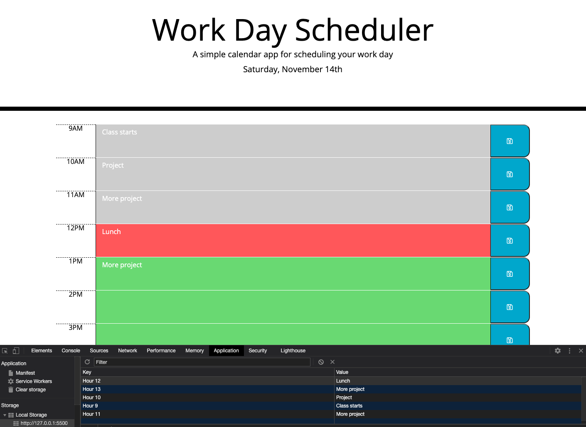

# Work-Day-Scheduler

## Goals for assignment

* Display the current date and hour
    * Past hours should display in gray
    * Current hour should display in red
    * Future hours should display in green
* Save event information according to the time it will be taking place
    * Click into the text box next to the corresponding hour and enter in text input
    * Click the save button next to the text box
    * The text should save, even if the page refreshes

## Links

* [GitHub Repo](https://github.com/elizabethbrandt/Work-Day-Scheduler)
* [Deployed Site](https://elizabethbrandt.github.io/Work-Day-Scheduler/)

## Lessons I learned with this assignment

#### Working with moment.js

* Creating a variable with moment.js allowed me to compare the current time to other times in order to create conditions

#### Event Delegation

* I struggled here the most becuase I wasn't sure how to make it so I didn't have to create a variable and click event for each hour.
* Using event delegation (`event.target`) allowed me to tie a specific function or action to whatever click triggered the event. Then I just had to direct what I wanted it to do based on the relationship to that click event.

#### Local Storage

* I struggled with scope on this one. I expected to be able to use the same variable names on `.setItem()` and `.getItem()`, but setting the items was wrapped inside a specific function. So defining how to get the items was key to making this work.

